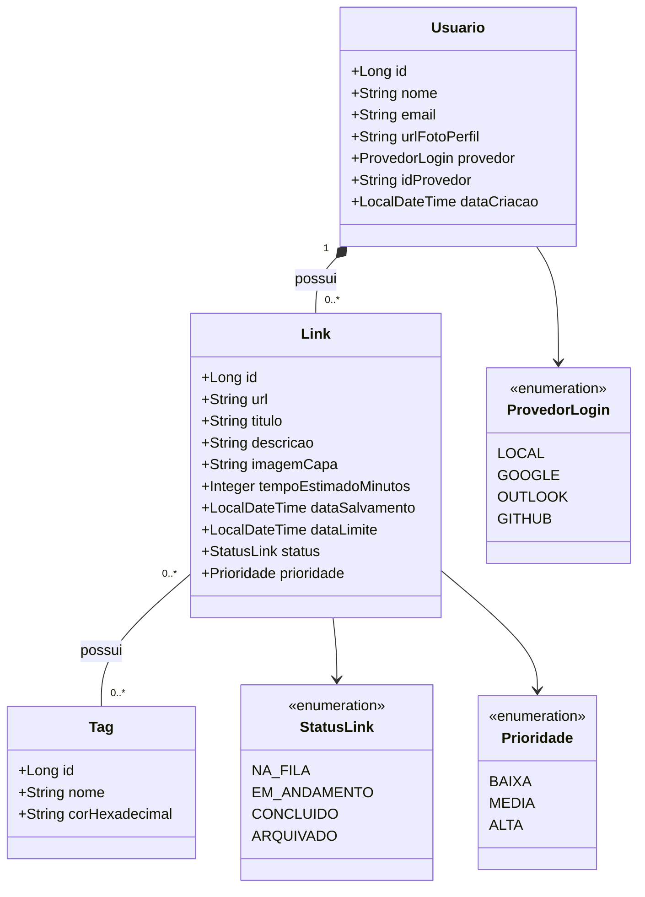

# 🔗 Meu Gestor

> Uma API RESTful desenvolvida em Java e Spring Boot para gestão inteligente de links, artigos e cursos, focada em resolver o problema de "acumulação de abas" e procrastinação.

## 📖 Sobre o Projeto
Este sistema nasceu da necessidade de gerenciar a enorme quantidade de links salvos no dia a dia (WhatsApp, navegador, etc.) que acabam esquecidos. Mais do que um simples "favoritos", esta aplicação atua como um **gestor de tempo pessoal**, estruturando o consumo de conteúdo digital.

Este projeto faz parte de uma pós-graduação em Tecnologia Java e serve como um portfólio prático de engenharia de software moderno. Detalhes adicionais de planejamento, decisões de arquitetura e opções de hospedagem estão documentados no arquivo interno **Projeto de gerenciamento**.

## 🚀 Funcionalidades (MVP e Futuras)
- [x] **Autenticação Segura:** Login Social via OAuth2 (Google Cloud), garantindo segurança delegada sem a necessidade de gerenciar senhas.
- [ ] **Gestão de Links:** CRUD completo de links com título, descrição e capa.
- [ ] **Classificação e Prioridade:** Definição de tempo estimado de leitura (ex: 5 min, 2 horas) e nível de prioridade (Baixa, Média, Alta).
- [ ] **Quadro Kanban (Status):** Fluxo de links entre "Na fila", "Em andamento", "Concluído" e "Arquivado".
- [ ] **Tags Customizadas:** Categorização flexível (ex: #Vagas, #Cursos, #Java) em relacionamento Muitos-para-Muitos.
- [ ] **Web Scraping Autônomo:** Extração automática de metadados (título, imagem) da URL salva utilizando Jsoup.
- [ ] **Sistema Anti-Procrastinação:** Alertas em background para links esquecidos ou próximos à data limite.

## 🛠️ Tecnologias Utilizadas
- **Linguagem:** Java 25
- **Framework Base:** Spring Boot 4.1.1
- **Persistência:** Spring Data JPA / Hibernate
- **Banco de Dados:** PostgreSQL (Foco em deploy Serverless como Supabase/Neon.tech)
- **Segurança:** Spring Security com OAuth2 Client
- **Documentação da API:** Springdoc OpenAPI (Swagger)
- **Build Tool:** Maven

*Nota:* O projeto optou por **não** utilizar a biblioteca Lombok por decisão arquitetural e acadêmica, priorizando a geração nativa de código (getters, setters, construtores) via IDE (IntelliJ IDEA) para maior transparência e controle estrutural das classes.

## 📐 Arquitetura e Modelagem de Dados

Abaixo está o diagrama de classes inicial da aplicação, modelado para suportar múltiplos usuários de forma isolada, permitindo a futura escalabilidade do sistema (SaaS).



## ⚙️ Como Executar o Projeto Localmente
### Pré-requisitos
- Java Development Kit (JDK) 25
- Maven instalado
- PostgreSQL rodando localmente (ou banco em nuvem)
- Credenciais do Google Cloud Console (Client ID e Client Secret) configuradas

### Passos
1. Clone o repositório:
```bash
   git clone [https://github.com/JuanBailke/Meu-Gestor.git](https://github.com/JuanBailke/Meu-Gestor.git)
```
2. Configure as variáveis de ambiente essenciais no arquivo `src/main/resources/application.yml`:
```Yaml
spring:
  datasource:
    url: jdbc:postgresql://localhost:5432/gestor_links
    username: seu_usuario
    password: sua_senha
  security:
    oauth2:
      client:
        registration:
          google:
            client-id: ${GOOGLE_CLIENT_ID}
            client-secret: ${GOOGLE_CLIENT_SECRET}
            scope:
              - email
              - profile
```
3. Execute a aplicação via linha de comando ou pela sua IDE (recomendado: IntelliJ IDEA):
```bash
mvn spring-boot:run
```